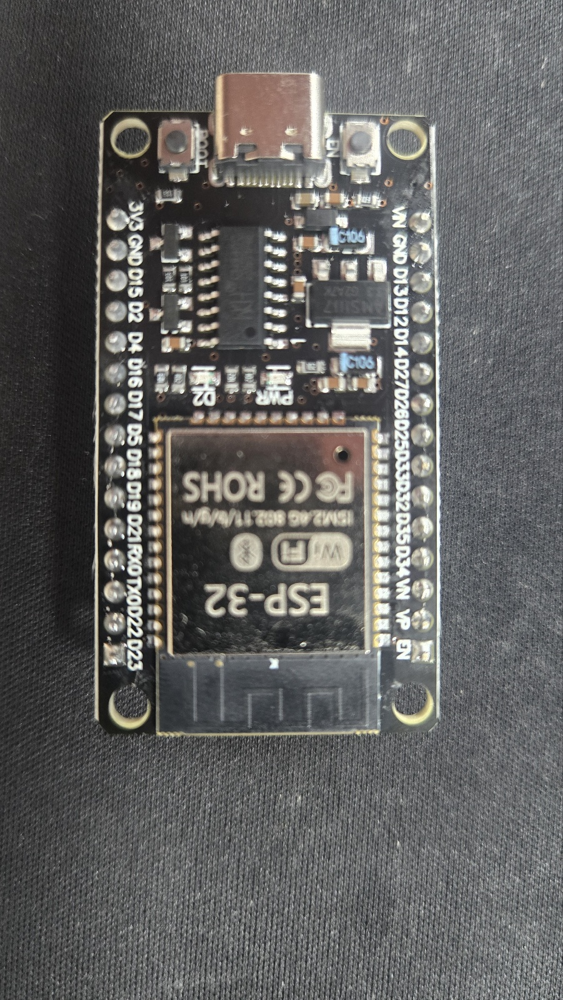

# 하드웨어 문서

KVX.OmniHub 에서 사용하는 하드웨어 부품 정리.

## 부품 목록

| 부품 | 역할 | 문서 |
|---|---|---|
| **ESP32 DevKit (USB-C, 30-pin)** | 메인 컨트롤러 (Wi-Fi + WebSocket 클라이언트) | [esp32-devkit.md](./esp32-devkit.md) |
| **YS-IRTM V2.06** | NEC IR 송수신 UART 모듈 | [ys-irtm.md](./ys-irtm.md) |

## 가이드

| 주제 | 문서 |
|---|---|
| **전원 제어 방식 (IR/WOL/HTTP_API/RELAY) + 필요 부품** | [power-control.md](./power-control.md) |

## 빠른 결선 (요약)

```
YS-IRTM         ESP32 DevKit
─────────────────────────────────────────────
VCC (5V)  ───  VIN (또는 보드의 5V/USB)
GND       ───  GND
TXD       ───  GPIO 16  (UART2 RX)  ※ 5V → 3.3V 분압 권장
RXD       ───  GPIO 17  (UART2 TX)  ※ 직결 OK
```

**상세 결선·전압 분압·예제 코드는 [ys-irtm.md](./ys-irtm.md) 참고.**

## 사진

| 부품 | 사진 |
|---|---|
| ESP32 DevKit |  |
| YS-IRTM (앞면 — 4핀 헤더, 22.1184 MHz 크리스털, IR 수신 돔, IR LED) |  |
| YS-IRTM (뒷면 — V2.06 실크, 3핀 보조 헤더 5V/S/GND) |  |
