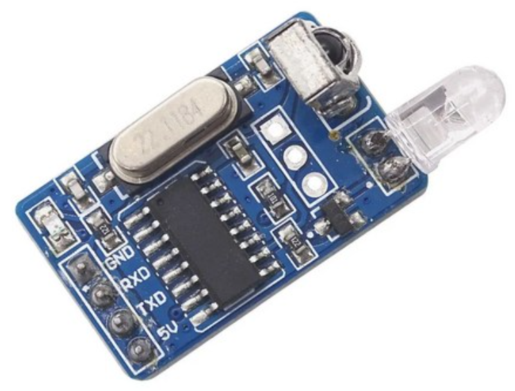
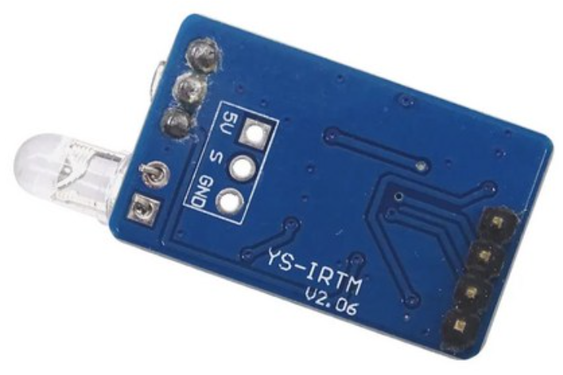

# YS-IRTM V2.06 — NEC IR Codec UART Module

5V 동작 UART 인터페이스 IR 송수신 모듈. 내부에 마이크로컨트롤러가 있어 NEC 프로토콜 디코딩/인코딩을 자체 처리하고, 시리얼로 디코딩된 hex 코드만 주고받음.

| 앞면 (4핀 헤더 + IR 수신 돔 + IR LED) | 뒷면 (V2.06 실크 + 3핀 보조 헤더) |
|---|---|
|  |  |

## 개요

| 항목 | 값 |
|---|---|
| 모델 | YS-IRTM (V2.06 등 리비전 존재) |
| 인터페이스 | UART (TTL 5V) |
| 기본 보레이트 | **9600** 8N1, no flow control |
| 지원 보레이트 | 4800 / 9600 / 19200 / 57600 (런타임 변경 가능) |
| 동작 전압 | **5V** (3.3V 동작 보장 안 됨) |
| 수신 IR 주파수 | 38 kHz NEC (940 nm) |
| 송신 IR LED | 940 nm, 38 kHz 변조 |
| 디코드 칩셋 호환 | uPD6121, uPD6122, TC9012, PT2221/2, SC6121/2, SC9012 등 |
| 크리스털 | 22.1184 MHz (보드에 보임) |
| 디바이스 주소 | 기본 `0xA1`, 변경 가능, failsafe `0xFA` |

> **중요 한계**: NEC repeat code 미지원. 리모콘 버튼을 길게 눌러도 1회만 캡처되고 반복 코드는 모듈이 무시함. 송신 시에도 반복 송출은 호스트가 직접 패킷을 재전송해야 함.

## 핀 배치

4핀 헤더 (모듈 가장자리, 보통 GND/RXD/TXD/5V 순서로 실크 표기):

| 핀 | 이름 | 설명 |
|:---:|:----:|---|
| 1 | GND | 접지 |
| 2 | RXD | 모듈이 받는 핀 (호스트 TX 와 연결) |
| 3 | TXD | 모듈이 보내는 핀 (호스트 RX 와 연결) — **5V 로직** |
| 4 | VCC / 5V | 5V 전원 |

> V2.06 PCB 에는 별도로 3핀 헤더 (`5V / S / GND`) 가 보이는 경우가 있는데, `S` 는 디코딩 전 raw IR 수신기 출력으로 추정. UART 통신만 쓰면 이 핀은 사용 안 함.

## 결선 — ESP32 DevKit

```
YS-IRTM            ESP32 DevKit
────────────────────────────────────────────
VCC (5V)   ───  VIN  (USB 공급 5V) 또는 5V 핀
GND        ───  GND
RXD  ───────── GPIO 17 (U2_TXD)            ※ 3.3V → 5V 직결 OK
TXD  ───┬─[10kΩ]─── GPIO 16 (U2_RXD)
        └─[20kΩ]─── GND                    ※ 5V → 3.3V 분압 (필수)
```

**분압 이유**: ESP32 GPIO 절대 최대 정격은 VDD+0.3V (≈3.6V). YS-IRTM TXD 가 5V HIGH 를 던지면 ESP32 RX 핀이 손상될 위험. 10k/20k 분압으로 ~3.33V 가 되어 안전.

**대안**: TXS0108E, BSS138 같은 양방향 레벨 시프터 (더 확실하고 ESD 보호).

> 일부 보고서 ([cnx-software](https://www.cnx-software.com/2017/04/20/karls-home-automation-project-part-4-mqtt-bridge-updated-to-use-ys-irtm-ir-receiver-transmitter-with-nodemcu/)) 에서는 ESP8266 에 직결해도 동작한다는 사례가 있으나, ESP32 데이터시트 기준으로는 분압 권장.

## 프로토콜 — 송신 (호스트 → 모듈)

5바이트 패킷:

```
[ADDR] [CMD] [D1] [D2] [D3]
```

- `ADDR`: 디바이스 주소 (기본 `0xA1`)
- `CMD`: 동작 코드
- `D1~D3`: 데이터

모듈이 명령을 정상 인식하면 응답으로 **`CMD` 1 바이트** 만 회신. 무시되면 응답 없음.

### 명령 일람

| ADDR | CMD | D1 | D2 | D3 | 동작 | 응답 |
|:----:|:---:|:--:|:--:|:--:|---|:----:|
| A1 | F1 | XX | YY | ZZ | NEC 코드 `XX YY ZZ` 송신 (4번째 바이트 `~ZZ` 자동 추가) | `F1` |
| A1 | F2 | A2 | 00 | 00 | 디바이스 주소를 `A2` 로 변경 | `F2` |
| A1 | F3 | 02 | 00 | 00 | 보레이트 변경 (1=4800, 2=9600, 3=19200, 4=57600) | `F3` |
| FA | F1 | XX | YY | ZZ | failsafe 주소로 송신 | `F1` |
| FA | F2 | A1 | 00 | 00 | failsafe 로 주소 리셋 | (응답 없음) |

### NEC 코드 송신 예시

```
A1 F1 00 FF 45    ⇒ NEC: address=0x00FF, command=0x45 송신
                    (모듈이 0xBA = ~0x45 자동 추가)
```

## 프로토콜 — 수신 (모듈 → 호스트)

리모콘이 NEC 코드를 보내면 모듈이 디코딩 후 **3 바이트** 송출:

```
[ADDR_HIGH] [ADDR_LOW] [CMD]
```

(NEC 의 4번째 inverse byte 는 검증 후 버려짐. 호스트로 안 옴.)

### 수신 예시

LG TV 전원 버튼:
```
04 FB 08        ⇒ address=0x04FB, command=0x08
```

## 예제 코드 — ESP32 / Arduino

```cpp
#include <Arduino.h>

#define IR_RX_PIN 16     // ESP32 RX (분압 후 모듈 TXD)
#define IR_TX_PIN 17     // ESP32 TX (모듈 RXD)
#define IR_BAUD   9600

HardwareSerial IRSerial(2);  // UART2

void setup() {
  Serial.begin(115200);
  IRSerial.begin(IR_BAUD, SERIAL_8N1, IR_RX_PIN, IR_TX_PIN);
  Serial.println("[ys-irtm] ready");
}

void loop() {
  // 수신: 3바이트 정수 단위로 처리
  static uint8_t buf[3];
  static uint8_t idx = 0;
  while (IRSerial.available()) {
    buf[idx++] = IRSerial.read();
    if (idx == 3) {
      Serial.printf("IR rx: %02X %02X %02X\n", buf[0], buf[1], buf[2]);
      idx = 0;
    }
  }

  // 송신: 5초마다 NEC 코드 한 번
  static uint32_t last = 0;
  if (millis() - last > 5000) {
    last = millis();
    const uint8_t pkt[] = { 0xA1, 0xF1, 0x00, 0xFF, 0x45 };
    IRSerial.write(pkt, sizeof(pkt));
    Serial.println("IR tx: A1 F1 00 FF 45");
  }
}
```

## 시스템 설계상 영향

OmniHub 의 `IrPayload` 타입 ([packages/shared/src/equipment.ts](../packages/shared/src/equipment.ts)):

```ts
interface IrPayload {
  protocol: IrProtocol;     // YS-IRTM 은 항상 "NEC"
  decoded: { value: string; bits: number } | null;
  raw: number[];            // YS-IRTM 으로는 캡처 불가 → 빈 배열
}
```

- **decoded**: `value` 에 `0xAABBCC` 같은 24-bit hex (모듈이 던진 3바이트), `bits: 32` (NEC 표준)
- **raw**: YS-IRTM 은 raw timing 을 노출하지 않으므로 `[]`. 다른 모듈(IR LED + TSOP) 로 교체할 때를 위해 필드는 유지

펌웨어가 받는 `ir_send` 메시지 처리:

```ts
// payload.decoded.value = "0x00FF45"
const value = parseInt(decoded.value, 16);
const pkt = [
  0xA1, 0xF1,
  (value >> 16) & 0xFF,
  (value >> 8) & 0xFF,
  value & 0xFF,
];
IRSerial.write(pkt);
```

## 알려진 제약

1. **NEC 만 지원** — Sony SIRC, RC5, RC6 등은 못 받음 (해당 리모콘은 다른 하드웨어 필요)
2. **Repeat code 없음** — 연속 송신은 호스트가 패킷 반복 전송
3. **raw timing 없음** — 비표준 프로토콜의 학습 불가
4. **3.3V 직결 위험** — 분압 또는 레벨 시프터 사용

## Sources

- [GitHub: mcauser/micropython-ys-irtm](https://github.com/mcauser/micropython-ys-irtm) — 가장 정확한 프로토콜 정리
- [PDF: NEC Infrared Codec Module ver1.0](https://server4.eca.ir/eshop/000/other/NEC%20infrared%20codec%20module%20YS-IRTM.pdf) — 원본 데이터시트
- [CNX-Software: Karl's Home Automation Project Part 4](https://www.cnx-software.com/2017/04/20/karls-home-automation-project-part-4-mqtt-bridge-updated-to-use-ys-irtm-ir-receiver-transmitter-with-nodemcu/) — NodeMCU 통합 사례
- [Theengs/OpenMQTTGateway forum: YS-IRTM IR gateway](https://community.openmqttgateway.com/t/ys-irtm-1-30-all-in-one-ir-send-receive-module/49) — MQTT 게이트웨이 통합
